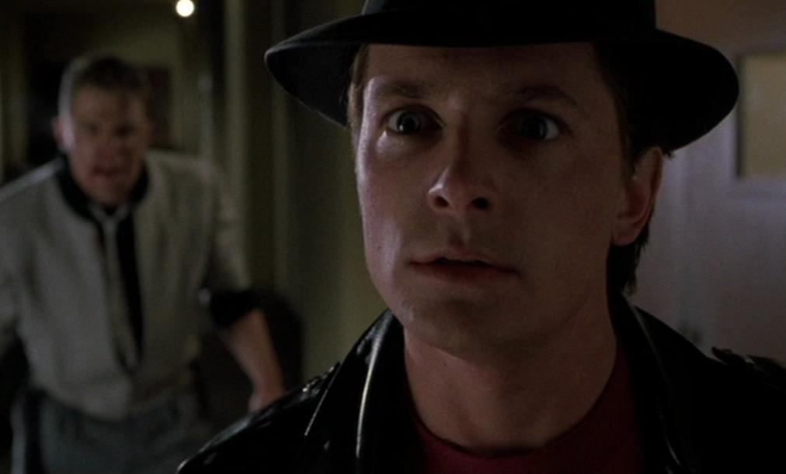
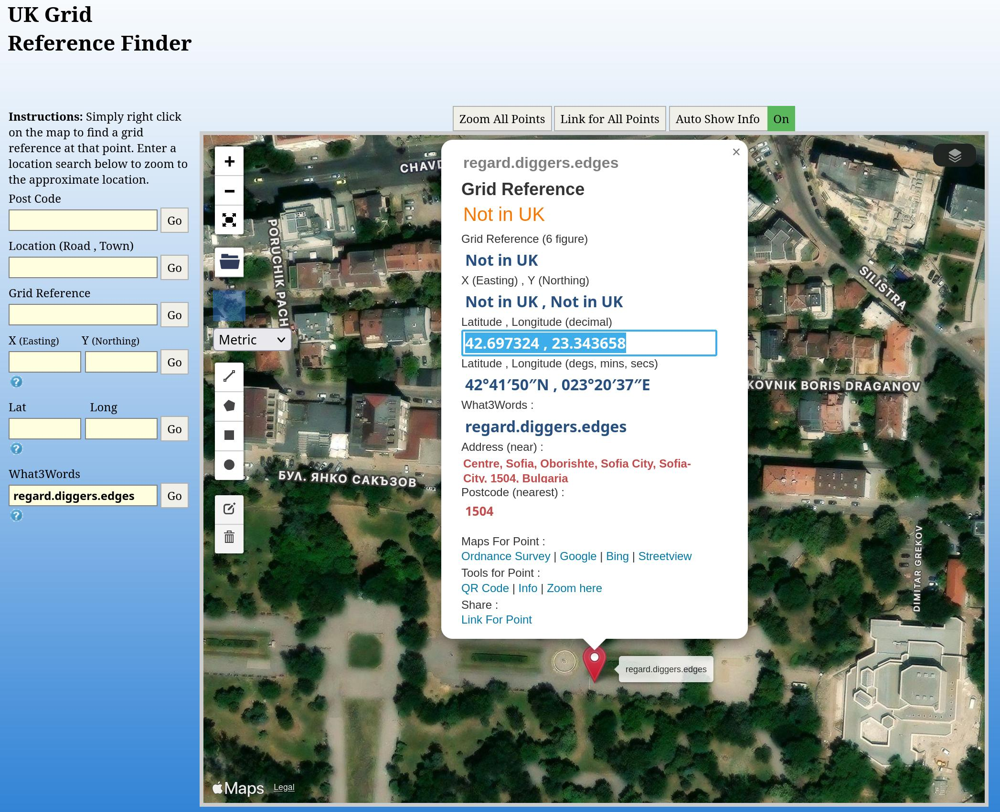
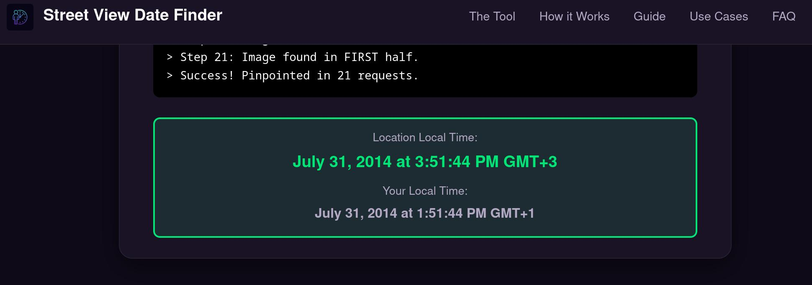
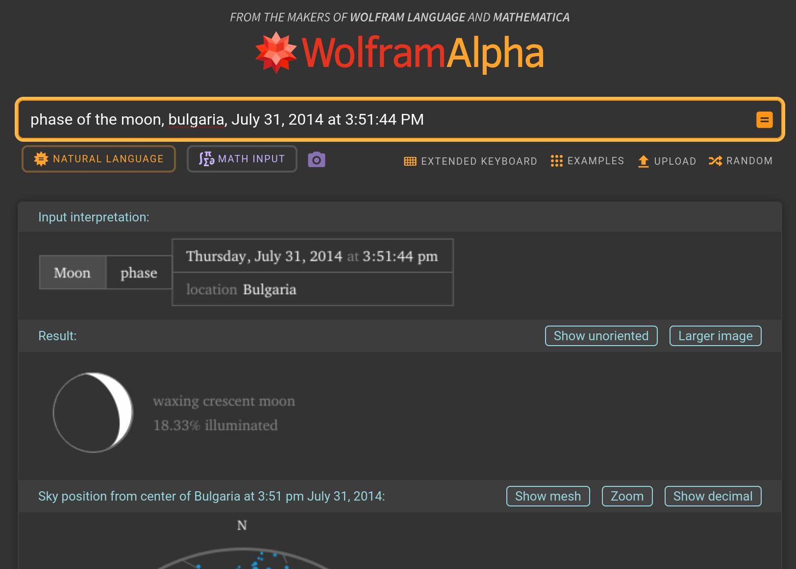

--8<-- "pages/solutions_working/gralhix_preamble.md"

## Introduction

I picked this challenge up because the challenge page stated "Unfortunately it is no longer possible to solve this exercise due to changes on Google Maps." I was very curious as to what might have changed in Google Maps to make it impossible. Also, telling me something is impossible is a bit like calling Marty McFly chicken... I just can't help myself...


/// caption
Nobody calls McFly chicken
///

(Potentially) interesting parts of the solution:

- Finding a "wrong" answer that still feels satisfying
- Using a tool to get the capture timestamp of street view footage
- Using Wolfram Alpha for correlating historical data
- [Gridreferencefinder.com](https://gridreferencefinder.com/), probably one of the most visited websites on my work computer

## Location

We are given a picture of a Twitter bio and the instruction to "locate". The location is a `what 3 words` location - these are essentially co-ordinates encoded into words. We are encouraged to use these in the UK when calling emergency services but I'm not sure how globally widespread they are!


/// caption
`What 3 words` location
///

Let's convert it back to co-ordinates so that we can look it up using other tools, using <https://gridreferencefinder.com/>:



Let's now open it in google maps using an (unintentional) clue from the challenge page: "Unfortunately it is no longer possible to solve this exercise due to changes on **Google Maps**."

```
!gm 42.697324, 23.343658
```

There is nothing immediately obvious by scanning the map, other than we are in the city of Sofia, matching the author's name. This indicates that we are probably on the right track!

Given that `what 3 words` is on a 3 metre x 3 metre grid, it indicates a precise location. I therefore zoomed directly into street view on the location but, again, there was nothing immediately obvious. The date of the image is July 2014, so would have existed when challenge was posted. However, it's possible that there was an image on street view after this that has since been deleted - this could possible explain why the challenge is "impossible".


/// caption
Street view date
///

## Finding the phase of the moon

I wondered if I could get the phase of the moon when the street view was captured so I googled "get date of streetview". The first result was <https://streetviewdate.com/> which gave this result when I pasted the google maps URL of the street view into it:


/// caption
Street view time of capture
///

I then loaded up [Wolfram Alpha](https://www.wolframalpha.com), which is a website that links lots of different datasets together (amongst other things). It's quite useful for finding historical weather so I wondered if it could also do moon phase. It gave this result:


/// caption
Phase of the moon
///

This gives an answer of "waxing crescent moon", which is unfortunately not the solution to the challenge! The desired answer can no longer be seen because it has been blurred out on google maps (I won't spoil the answer here, I recommend that you watch the [author's video](https://www.youtube.com/watch?v=pgu3iFvyBPQ)). However, I still consider this a "good" solution which contains interesting techniques (I would say that though, wouldn't I!).

## Final Answers

| Item | Information Required | Answer                                                              |
| ---- | -------------------- | ------------------------------------------------------------------- |
| a    | Phase of the moon    | Waxing crescent moon (not the answer the challenge was looking for) |
